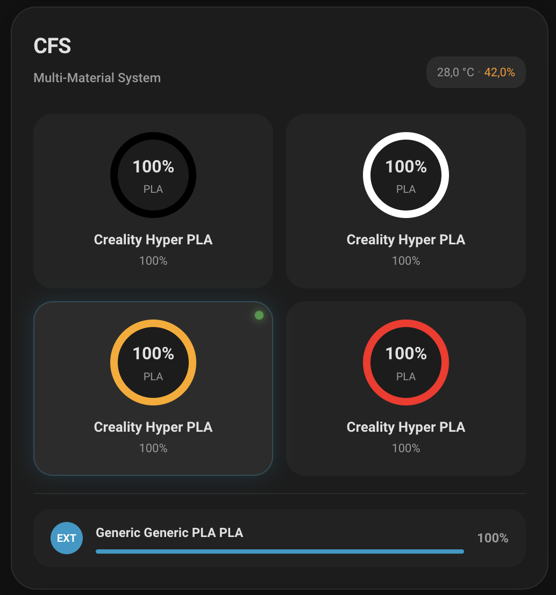
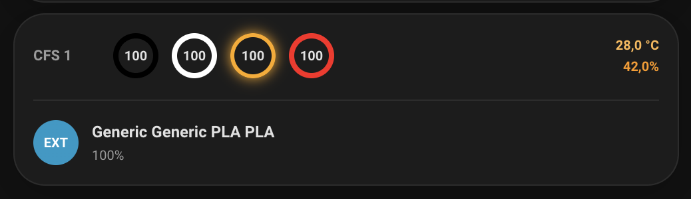

[](https://ko-fi.com/3dg1luk43)

# Creality WebSocket Integration for Home Assistant

This custom [Home Assistant](https://www.home-assistant.io/) integration provides **native, low-latency WebSocket control and telemetry** for Creality K‑series and compatible 3D printers. It exposes live state, sensors, controls, a camera stream, and a printer‑local **Current Print Preview** image. A **standalone Lovelace card** (no external card dependencies) is bundled.

---

## Features

* **Direct WebSocket** connection (local, no cloud).
* **Push updates**; no polling.
* **States:** `idle`, `printing`, `paused`, `stopped`, `completed`, `error`, `self-testing`.
* **Optional power switch binding** to a `switch` entity for accurate "Off" handling.
* **Entities:** status, progress, time left, temperatures (nozzle/bed/chamber), current layer/total layers, etc.
* **Image (print preview):** shows the current model image for all supported printers when available; falls back to a tiny placeholder when not applicable.
* **Controls:** pause, resume, stop, light toggle.
* **Camera:** auto-detects stream type by model (MJPEG or WebRTC).
* **Lovelace card**: dependency-free, uses HA fonts, progress ring, contextual chips, telemetry pills.
* **Style Editor**: Built-in theme customization with color picker for all card elements.

---

## Installation

### HACS (recommended)

[](https://my.home-assistant.io/redirect/hacs_repository/?owner=3dg1luk43&repository=ha_creality_ws&category=integration)

- This integration is available in HACS by default. Click the badge above to open it directly in HACS.
- If needed, you can add it manually as a custom repository: https://github.com/3dg1luk43/ha_creality_ws
- After install, **Restart** Home Assistant.

### Installing Pre-release Builds

To install a specific pre-release version via HACS:

1. Open **HACS**.
2. Navigate to the **Creality WebSocket Integration**.
3. Click the three-dot menu (⋮) at the top right and select **Redownload**.
4. In the version dropdown, toggle **Show beta versions** if needed, then select the latest pre-release version.
5. Click **Download**.
6. **Restart** Home Assistant.
7. Hard refresh your browser (Ctrl+F5) to ensure the frontend card updates.

### Manual

1. Copy `custom_components/ha_creality_ws` into `<config>/custom_components/`.
2. **Restart** Home Assistant.

## Configuration

### 1) Add the integration (UI)

[](https://my.home-assistant.io/redirect/config_flow_start/?domain=ha_creality_ws)

- Or go to **Settings → Devices & Services**
- Click **Add Integration**
- Search for **Creality WebSocket Integration**
- Enter the printer hostname/IP and a friendly name
- Zeroconf is supported; devices may auto-discover via mDNS

### 2) Optional: bind a power switch

If your printer power is controlled by a smart plug/switch, enable power detection so the integration can accurately reflect "Off" status and zero sensors when power is disabled.

* **Settings → Devices & Services →** your printer **→ Configure**
* Enable the **Power Switch** toggle
* Select your smart plug/switch entity (supports `switch`, `input_boolean`, and `light` domains)
* Submit

**Behavior:**
- When **enabled**: The integration monitors your switch entity. If it's OFF, the printer status shows as "Off" and all sensors zero out. Reconnection attempts use adaptive backoff (respects power state).
- When **disabled**: The integration doesn't monitor any switch. All sensors update normally based on WebSocket telemetry.
- **Safe defaults**: Existing users will auto-migrate on first load. If you previously had a power switch configured, it will be re-enabled automatically.

### 3) Optional: camera mode

If auto-detection doesn't choose your preferred stream, you can force it under the integration's Configure dialog:

- **Camera Mode**: 
  - `auto` (default) - Automatically detect based on printer model
  - `mjpeg` - Force direct MJPEG stream
  - `webrtc` - Force WebRTC streaming

If your Home Assistant version is older than 2025.11, WebRTC requires an external go2rtc (>= 1.9.11). Set its URL/port in the integration options.

### Dependencies

The integration automatically installs the following Python packages:
- `websockets>=10.4` - For WebSocket communication with printers
- `go2rtc-client>=0.1.0` - For WebRTC camera stream coordination

**Camera Dependencies:**
- **K1 family & Ender 3 V3 family cameras**: No additional dependencies required (MJPEG streaming)
- **K2 family cameras (WebRTC):**
  - Native WebRTC out of the box is supported only on **Home Assistant Core 2025.11+** (bundled go2rtc version compatible with Creality).
  - If you're on an older Home Assistant release, configure an external **go2rtc >= 1.9.11** and point the integration to it via the Options dialog (host/port).

---

## Lovelace Card

This repository **bundles** standalone cards. The integration serves the card files directly from its own `www/` directory (at `/ha_creality_ws/k_printer_card.js` and `/ha_creality_ws/k_cfs_card.js`) and **auto-registers** the Lovelace resources **in storage mode**.

### Card screenshots

Below are example screenshots of the card interface states:

Idle


Off


Printing


Processing


Color picker


### Resource registration

* **Storage mode (default)**
  The integration registers the resource automatically with cache-busting:

  ```
  /ha_creality_ws/k_printer_card.js   (type: module)
  /ha_creality_ws/k_cfs_card.js       (type: module)
  ```

  If you ever remove/re-add the integration or migrate dashboards, verify it under:
  **Settings → Dashboards → ⋮ → Resources**.

* **YAML mode**
  Add this to your configuration:

    ```yaml
  lovelace:
    resources:
      - url: /ha_creality_ws/k_printer_card.js
        type: module
  ```
  
  The card is served from the integration's own `www/` directory, not from `<config>/www/`.

### Forcing Storage mode (if you previously used YAML)

If you want to switch to storage mode explicitly:

```yaml
# configuration.yaml
lovelace:
  mode: storage
```

Restart HA after changing this.

### **Hard refresh is required after first install/update**

Lovelace caches frontend resources aggressively. After installing/updating the card or integration:

* Desktop: **Ctrl+F5** (Windows/Linux), **⌘+Shift+R** (macOS)
* Mobile app: **App Settings → Reload resources** or force close + reopen.

If you still see stale UI, append a cache-buster query once:

```
/ha_creality_ws/k_printer_card.js?v=1
```

Then remove the `?v=` the next time.

---

## Image: Current Print Preview

The integration adds an `image` entity named "Current Print Preview" for all supported printers:

- Tries the printer‑local PNG at `/downloads/original/current_print_image.png` (HTTPS first, then HTTP), with short timeouts.
- Only fetches when it makes sense (e.g., self‑testing or printing with a file name); otherwise shows a small placeholder PNG.
- Caches the last successful image to avoid flicker; never calls any cloud service.
- Records each attempted printer‑local HTTP(S) URL in diagnostics to aid support.

Tip: You can use the built‑in Image card or any card that supports `image` entities to display it on dashboards.

---

## Card Usage

The card's element tag is **`custom:k-printer-card`**.

Add via UI (Manual card) or YAML:

```yaml
type: custom:k-printer-card
name: "K1C Printer"
camera: camera.k1c_printer_camera
status: sensor.k1c_print_status
progress: sensor.k1c_print_progress
time_left: sensor.k1c_print_time_left
nozzle: sensor.k1c_nozzle_temperature
bed: sensor.k1c_bed_temperature
box: sensor.k1c_box_temperature
layer: sensor.k1c_working_layer
total_layers: sensor.k1c_total_layers
light: switch.k1c_light
power: switch.printer_power  # Optional
pause_btn: button.k1c_pause_print
resume_btn: button.k1c_resume_print
stop_btn: button.k1c_stop_print
```

**Behavior:**

* Header icon color + conic progress ring reflect state and progress.
* Chips:

  * **Pause** shown when `printing|resuming|pausing`.
  * **Resume** shown when `paused`.
  * **Stop** shown when `printing|paused|self-testing`.
  * **Light** toggles the configured `switch`/`light` entity; shows/hides based on Power state and printer status.
  * **Power** (optional) offers a snappy, short-lived optimistic toggle; pinned to the far right when configured.

**Configuration Notes:**
- `power` is optional; omit it to hide the power chip.
- Light chip visibility automatically reacts to power state and printer status without reload.
- Light strictly mirrors entity state (doesn't use optimistic overrides) to avoid desync.
- Tapping the header opens **more-info** for `camera` (fallbacks: `status`, `progress`).

---

## CFS (Creality Filament System)

If your printer reports CFS data, the integration creates sensors for each CFS box and slot. It also exposes a dedicated set of sensors for the **external filament** (single slot).

### CFS Sensors

**Box sensors (type 0 / CFS):**

- `sensor.<host>_cfs_box_<box>_temp`
- `sensor.<host>_cfs_box_<box>_humidity`

**Slot sensors (type 0 / CFS):**

- `sensor.<host>_cfs_box_<box>_slot_<slot>_filament`
- `sensor.<host>_cfs_box_<box>_slot_<slot>_color`
- `sensor.<host>_cfs_box_<box>_slot_<slot>_percent`

**External filament (type 1 / single slot):**

- `sensor.<host>_cfs_external_filament`
- `sensor.<host>_cfs_external_color`
- `sensor.<host>_cfs_external_percent`

### CFS Card

The CFS card is a native UI card with a visual editor. It renders one tile per slot and a dedicated tile for the external filament.

- Card type: **Creality CFS Card**
- Element tag: **`custom:k-cfs-card`**
- Configuration is **entity mapping only** via the visual editor (no YAML flow required)

**Editor fields:**

- **External Filament**: map `external_filament`, `external_color`, `external_percent`
- **Box 1–4**: map temperature/humidity and up to 4 slots per box

**Behavior:**

- Each slot tile opens **more-info** for the mapped filament entity
- Percent is rendered from the mapped percent sensor and formatted by Home Assistant
- Filament color uses the mapped color sensor (or color hex from filament attributes)
- **Active filament** shows a pulsing green dot indicator when currently selected by the printer
- **Humidity levels** are color-coded following Creality standards:
  - **Green** (< 40%): Ideal humidity range
  - **Orange** (40-59%): Attention required
  - **Red** (≥ 60%): Critical humidity level

### CFS Card screenshots

Full view



Compact view



---

## Style Editor

The card includes a built-in **Style Editor** that allows you to customize the appearance of all card elements. Access it through the card editor's **Theme** tab.

### Features

* **Interactive Color Picker**: Click on any element to open a color picker
* **Live Preview**: See changes applied immediately to the card
* **Theme Persistence**: Customizations are saved and persist across integration updates
* **Auto Mode**: Status and telemetry elements can inherit Home Assistant theme colors
* **Reset to Defaults**: One-click reset to restore original styling

### Customizable Elements

#### Button Colors
- **Pause Button**: Background and icon colors
- **Resume Button**: Background and icon colors  
- **Stop Button**: Background and icon colors
- **Light Button**: Background and icon colors (separate for on/off states)
  - Light On Background & Icon
  - Light Off Background & Icon

#### Status Elements
- **Status Icon**: Color (auto mode inherits theme colors)
- **Progress Ring**: Color (auto mode inherits theme colors)
- **Status Background**: Background color (auto mode uses card background)

#### Telemetry Elements
- **Telemetry Icons**: Color (auto mode inherits secondary text color)
- **Telemetry Text**: Color (auto mode inherits primary text color)

### Usage

1. **Open Card Editor**: Click the card's menu (⋮) → **Edit**
2. **Switch to Theme Tab**: Click the **Theme** tab in the editor
3. **Customize Colors**: 
   - Click on any element to open its color picker
   - Use the color preview square to open the native color picker
   - Type hex codes directly (e.g., `#ff0000`)
   - Type `auto` to inherit Home Assistant theme colors
4. **Save Changes**: Click **Save** on the color picker, then **Save** on the card
5. **Reset**: Use the **Reset to Defaults** button to restore original styling

### Color Formats

- **Hex Colors**: Use standard hex format (e.g., `#ff0000`, `#00ff00`)
- **Auto Mode**: Type `auto` to inherit Home Assistant theme colors
- **Theme Integration**: Auto mode automatically adapts to light/dark themes

### Persistence

Your customizations are automatically saved and will persist across:
- Home Assistant restarts
- Integration updates
- Dashboard reloads

The theme data is stored per card instance, so each card can have its own unique styling.

---

## Camera

The integration auto-detects the printer model and creates the appropriate camera entity. Camera support varies by model:

### Camera Support by Model

**MJPEG Cameras:**
- **K1/K1C/K1 Max**: Camera included. Works with all Home Assistant camera cards.
- **K1 SE**: Camera is optional accessory (gracefully handles when not present).
- **Ender 3 V3 family**: Camera is optional accessory (gracefully handles when not present).
- **Creality Hi**: Camera included. Works with all Home Assistant camera cards.
- **K1C (Classic)**: MJPEG camera included.

**WebRTC Cameras:**
- **K1C (2025)**: Native WebRTC streaming (auto-detected via telemetry).
- **K2 family** (K2, K2 Pro, K2 Plus): Native WebRTC streaming using Home Assistant's built-in go2rtc service.
  - Uses go2rtc for WebRTC streaming
  - Configures go2rtc to connect to the printer's WebRTC signaling endpoint
  - Forwards WebRTC offers/answers between Home Assistant frontend and go2rtc
  - Provides native WebRTC streaming without additional HACS integrations
  - Works with all standard Home Assistant camera cards that support WebRTC

---

## Troubleshooting

* **"Configuration error" in picker or blank card**
  Hard refresh Lovelace. Verify the resource exists (see *Resource registration*). Ensure the element type is `custom:k-printer-card`.
* **Controls do nothing**
  Confirm the `pause_btn`, `resume_btn`, `stop_btn` entities exist and are `button.*`. The card calls `button.press`.
  Confirm the light entity domain is `switch` or `light`.
* **Sensors stay zeroed when printer is on**
  Enable the **Power Switch** in the integration's Configure dialog. If power is OFF but your printer is actually on, disable the power switch to stop the integration from zeroing sensors.
* **Connection takes too long when power is OFF**
  If you have **Power Switch** enabled and the printer is OFF, the integration waits 60 seconds between connection attempts (to save resources). This is intentional. Enable power detection so the integration can react immediately when power returns.
* **Resource missing in storage mode**
  Remove + re-add the integration or add the resource manually under **Dashboards → Resources** pointing to `/ha_creality_ws/k_printer_card.js`.
* **WebRTC camera not working**
  If K2 family cameras show fallback images instead of live video:
  1. Check your Home Assistant version:
     - On **2025.11+**: go2rtc is bundled and compatible. Verify `http://localhost:11984` is reachable and streams are present under `/api/streams`.
     - On **older versions**: you must run an external go2rtc **>= 1.9.11** and set its host/port in the integration options.
  2. Ensure the printer's WebRTC signaling endpoint is accessible from go2rtc.
  3. Verify the printer supports WebRTC (K2 family only).
  4. Check Home Assistant logs for WebRTC negotiation errors.
* **K2 camera shows no image**
  - Check that the printer's WebRTC endpoint is accessible
  - Verify the printer model is correctly detected (check logs for "detected K2 family printer")
  - Ensure Home Assistant's built-in go2rtc service is running
  - Check for WebRTC message format errors in logs
* **Manual camera mode not working**
  - Check logs for "user forced [mode] mode" messages
  - Verify the camera mode is set correctly in the integration's Configure dialog
  - Restart Home Assistant after changing camera mode settings
  - For `webrtc` mode: ensure Home Assistant's built-in go2rtc service is running

---

## Supported Models

### K1 Family
- **K1** - Box temperature sensor only (no control), light, MJPEG camera
- **K1C** - Box temperature sensor only (no control), light, MJPEG camera  
- **K1C (2025)** - Box temperature sensor only (no control), light. **Camera currently NOT supported** (dependency issues with go2rtc).  
- **K1 SE** - No box temperature, no light, optional MJPEG camera
- **K1 Max** - Box temperature sensor only (no control), light, MJPEG camera

### K2 Family
- **K2** - Box temperature sensor & control, light, WebRTC camera
- **K2 Pro** - Box temperature sensor & control, light, WebRTC camera
- **K2 Plus** - Box temperature sensor & control, light, WebRTC camera

### Ender 3 V3 Family
- **Ender 3 V3** - No box temperature, no light, optional MJPEG camera
- **Ender 3 V3 KE** - No box temperature, no light, optional MJPEG camera
- **Ender 3 V3 Plus** - No box temperature, no light, optional MJPEG camera

### Other Models
- **Creality Hi** - No box temperature, light, MJPEG camera

Other K-series models may work but are unverified.

---

## Model Detection Reliability

Printers can take a few telemetry frames before reporting their friendly `model`, `modelVersion`, and `hostname`. To avoid flakiness during onboarding the integration:

* Waits briefly for core fields (`model`, `modelVersion`, `hostname`) before caching device info.
* Falls back to board codes (`modelVersion` codes like F012/F021/F008/F001/F002/F005/F018) to resolve a stable model name when the friendly string is empty.
* Promotes capabilities heuristically if telemetry exposes fields early (e.g., `boxTemp`, `maxBoxTemp`, `targetBoxTemp`, `lightSw`).
* Ensures existing installations keep their cached capabilities and camera mode without regression.

Terminology note: UI labels may say "Chamber" instead of "Box" in some places; entity IDs and protocol fields remain stable for backward compatibility.

This logic reduces first-time setup races and prevents empty model names in the device registry.

---

## Status / Testing

Currently verified on:
- **Creality K1C** - Full functionality including box temperature and light controls (@me)
- **Creality Ender 3 V3 KE** - Full functionality (no box temperature or light controls, optional camera) (@Graf17)
- **Creality K2 Pro / K2 Plus** - WebRTC camera verified with Home Assistant 2025.11 release (native).
  - For older Home Assistant versions, verified with external go2rtc 1.9.11+. (@hawky358 & sammyke007)
- **Creality K1 (Base)** - Box temperature sensor only (no control), light, MJPEG camera
- **Creality Hi** - Fully working (forum user @TheDon)

---

## Diagnostic Service

The integration provides a diagnostic service to help with troubleshooting and understanding what data different printer models send via WebSocket.

### Usage

1. Go to **Developer Tools** → **Services**
2. Select service: `ha_creality_ws.diagnostic_dump`
3. Click **Call Service**
4. **Copy the diagnostic data** from the service response in the UI

The service will return the complete diagnostic data in the response that you can copy and paste directly. The data is also saved to a file in your Home Assistant config directory as a backup.

**Service Response includes:**

- **Complete WebSocket telemetry data** from all connected printers
- **Model detection results** showing how each printer is classified
- **Feature detection results** showing which features are enabled/disabled
- **Printer status information** (availability, power state, etc.)
- **Home Assistant and integration version information**
- **Printer‑local HTTP URLs accessed** (e.g., preview fetch attempts) for support diagnostics

### What's Included

The diagnostic file contains:
- All raw telemetry data received from the printer
- Model detection logic results (K1, K2, Ender 3 V3, etc.)
- Feature detection results (camera type, light, box temperature, etc.)
- Connection status and timing information
- Integration configuration details
 - Cache of local HTTP(S) URLs the integration accessed (no cloud)

### Sharing Diagnostic Data

The diagnostic data can be safely shared with developers for troubleshooting. It contains only telemetry data and configuration information - no sensitive personal data.

**How to share:**
1. Call the service as described above
2. Copy the `diagnostic_data` field from the service response
3. Paste it into a text file or share directly with developers

**Service Response Format:**
```json
{
  "diagnostic_data": "{...complete JSON data...}",
  "file_path": "/config/creality_diagnostic_20241220_143022.json",
  "data_size": 12345,
  "printers_count": 1
}
```

---

## License

MIT. See `LICENSE`.
